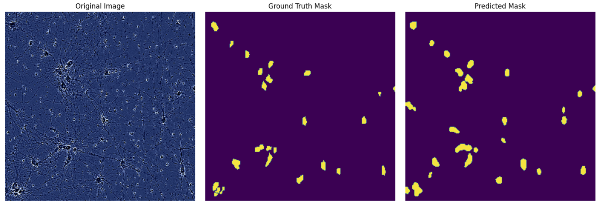
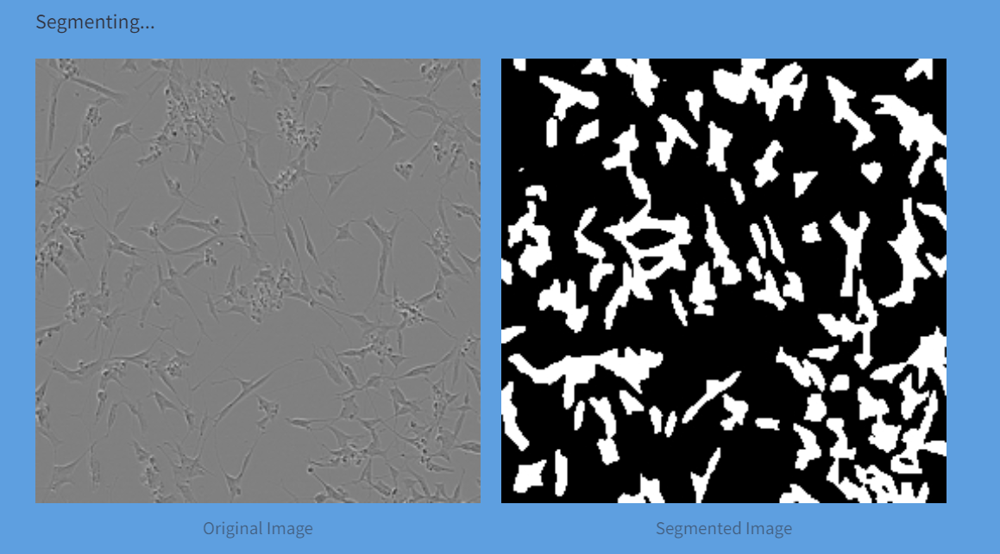

# cell-segmentation-UNET
Segmentation masks on neuron cell images using UNET

## Table of Contents 

- [cell-segmentation-UNET](#cell-segmentation-unet)
  - [Table of Contents](#table-of-contents)
  - [Project Overview](#project-overview)
  - [Dataset](#dataset)
  - [Model Architecture](#model-architecture)
  - [Training Process](#training-process)
  - [Evaluation](#evaluation)
  - [Deployment](#deployment)
  - [Sample test result from API](#sample-test-result-from-api)

  
## Project Overview 

 This project involves developing a deep learning model to perform image segmentation on the LIVECell dataset, a large-scale dataset for label-free live cell segmentation. The goal is to create a segmentation model, deploy it as a web service on a local Docker container, and provide a demoable endpoint. The model has been trained using U-Net architecture.  

The project aims to train a segmentation model using the referenced dataset and deploy it as a web service. 

## Dataset 

The LIVECell dataset was created to address the need for annotated data in label-free cellular imaging. The dataset is the largest of its kind, consisting of over 1.6 million cells with diverse morphologies and culture densities. The LIVECell dataset contains images from light microscopy, which is a non-invasive and high-throughput modality used for studying biological phenomena.   

Data is available at: https://github.com/sartorius-research/LIVECell?tab=readme-ov-file  

 
## Model Architecture 

For this project, a U-Net model was selected due to its proven effectiveness in image segmentation tasks. U-Net is a convolutional neural network that is specifically designed for biomedical image segmentation, making it a suitable choice for the LIVECell dataset. 

## Training Process 

The training process for the segmentation model involves several critical steps, utilizing a U-Net architecture with a ResNet34 encoder pre-trained on ImageNet. The dataset, derived from the LIVECell dataset, includes cell images and corresponding annotations in run-length encoding (RLE) format, which are decoded into binary masks stored as NumPy arrays. 250 data samples were selected and split into training (200) and validation sets (50), with images and masks resized to 256x256 pixels, normalized, and converted into PyTorch tensors using albumentations for augmentation. The U-Net model, designed to take 3-channel RGB images as input and output a single-channel mask, is trained over 40 epochs. The training loop involves calculating Dice loss, which is effective for handling class imbalance, and optimizing the model using the Adam optimizer with a learning rate of 0.01. During each epoch, the model's performance is evaluated on the validation set using Intersection over Union (IoU) and accuracy metrics. Visualizations of the model's predictions alongside the original images and ground truth masks are used for qualitative assessment. 

## Evaluation 

To validate the trained model, predicted masks was compared to the ground truth and the following metrics generated using 50 images: 

**Mean Jaccard Score (IOU): 0.5540969683729344 Mean Accuracy Score: 0.9330062866210938** 

  

 

## Deployment 

The trained model is deployed as a web service using a local Docker container. The deployment includes: 

- **app.py**: A Streamlit application that serves the model as an API endpoint. 

- **Dockerfile**: Defines the environment setup for the model deployment. 

- **requirements.txt**: Lists all necessary dependencies for running the model. 

   

4. **Test the API**: The following approaches can used to test the end points 

 **1. Using a streamlit endpoint (Feel free to try)**: copy to web browser https://neuron-cell-segmentation-unet.streamlit.app  

**2. Using the Docker Image**:  run the line of code below to pull the docker image.

-docker pull lucynwosu123/neuron-cell-unet-segmentation:latest 

- copy the resulting url to the web browser: http://0.0.0.0:8501 

## Sample test result from API	 

 

 

